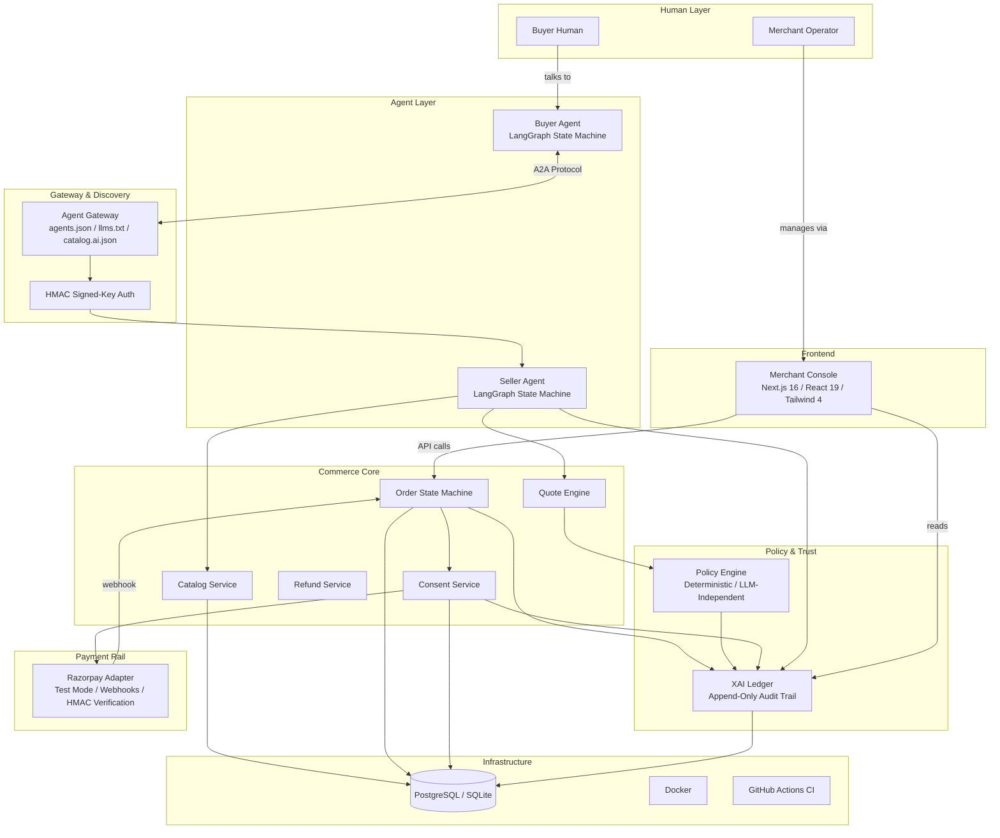
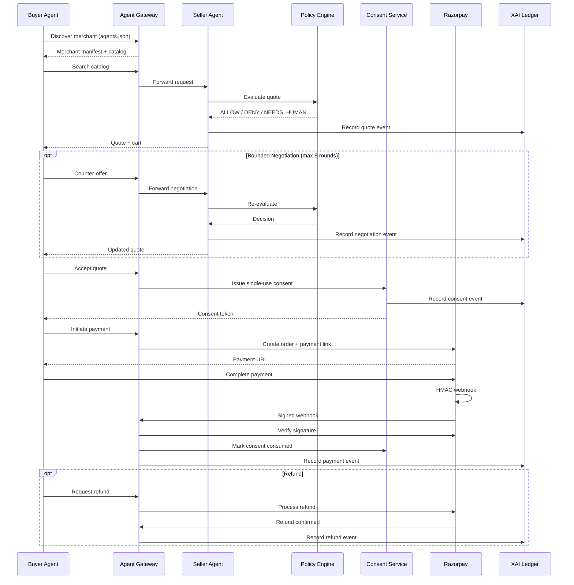
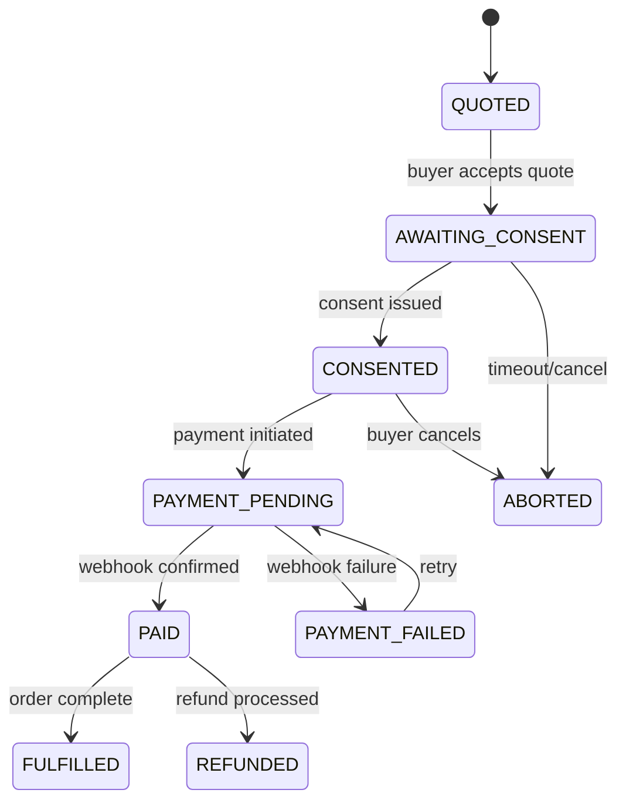
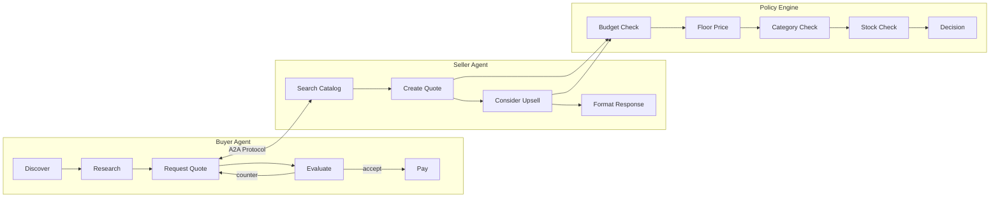
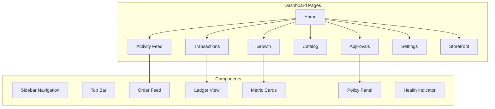

<div align="center">


<br/>

### Agentic Commerce Infrastructure

**Infrastructure that lets AI buyers discover, negotiate with, and safely purchase from merchants -- with deterministic policy enforcement and full audit trails.**

<br/>

[](https://github.com/sellable/sellable/actions)
[](https://www.python.org/)
[](https://fastapi.tiangolo.com/)
[](https://langchain-ai.github.io/langgraph/)
[](https://nextjs.org/)
[](https://react.dev/)
[](https://www.typescriptlang.org/)
[](https://tailwindcss.com/)
[](https://razorpay.com/)
[](https://www.docker.com/)
[](https://www.sqlite.org/)
[](LICENSE)

<br/>

[Features](#features) | [Architecture](#architecture) | [Quick Start](#quick-start) | [API](#api-reference) | [Docs](#documentation)

</div>

---

## What Is SELLABLE?

The commerce landscape is shifting. AI buyers -- Perplexity, OpenAI shopping agents, Google Procurement -- are beginning to **discover, negotiate, and purchase** products autonomously. Merchants today are built for human eyeballs: HTML storefronts, coupon codes, manual carts. They are **invisible and unusable to AI buyers**.

**SELLABLE** solves this. It makes any merchant:
- **Discoverable** -- via machine-readable `agents.json`, `llms.txt`, and a product catalog API
- **Negotiable** -- bounded, policy-governed agent-to-agent price negotiation
- **Safely transactable** -- deterministic policy engine, single-use consent, real Razorpay payments, full audit trail

> **The LLM proposes, the policy engine disposes -- and every action leaves an explanation.**

---

## The Bar We Meet

| Requirement | Implementation |
|---|---|
| **Explainable transactions** | XAI Ledger records every agent action with trace_id, policy refs, and reasoning summaries |
| **Real rails, not mocks** | Razorpay test-mode payments, HMAC webhook verification, real refund flow |
| **Consent & guardrails** | Per-transaction single-use consent, spend caps, floor prices, human-in-the-loop thresholds |
| **End-to-end demo** | Discovery -> negotiation -> consent -> payment -> receipt -> refund, all live |

---

## Features

- **Commerce Core** -- Catalog, pricing, quotes, orders, consent, refunds -- all deterministic
- **Agent Gateway** -- Machine-facing discovery (`/.well-known/agents.json`) and transactional API with HMAC signed-key auth
- **Seller Agent** -- LangGraph state machine: search -> quote -> upsell -> respond, bounded by policy
- **Buyer Agent** -- Reference implementation: discover -> research -> request_quote -> evaluate
- **Policy Engine** -- Pure, LLM-independent evaluator: budget, floor price, categories, stock, negotiation rounds, HITL threshold
- **XAI Ledger** -- Append-only audit trail with reasoning summaries for every material action
- **Merchant Console** -- Next.js dashboard: activity feed, approval queue, catalog management, growth insights
- **Payment Integration** -- Razorpay test-mode with webhook reconciliation and refund support
- **Evaluation Framework** -- 7 deterministic scenarios covering valid purchase, denial, HITL, payment failure, idempotency

---

## Architecture

### High-Level System Architecture



### Transaction Lifecycle



### Core Transaction State Machine



### Agent Interaction Flow



### Merchant Console Dashboard



---

## Quick Start

### Prerequisites

- **Python 3.11+**
- **Node.js 18+** (for Merchant Console)
- **Razorpay test-mode keys** (optional, for payment integration)

### 1. Clone & Install

```bash
git clone https://github.com/sellable/sellable.git
cd sellable

# Backend
python -m venv .venv
source .venv/bin/activate  # or .venv\Scripts\activate on Windows
pip install -e ".[dev]"

# Frontend
cd apps/merchant-console
npm install
cd ../..
```

### 2. Configure Environment

```bash
cp .env.example .env
```

Edit `.env` with your Razorpay test credentials:

```env
SELLABLE_ENVIRONMENT=development
DATABASE_URL=sqlite:///data/sellable.db
RAZORPAY_KEY_ID=rzp_test_...
RAZORPAY_KEY_SECRET=...
RAZORPAY_WEBHOOK_SECRET=...
```

### 3. Run the Backend

```bash
python -m uvicorn sellable.main:app --reload --host 0.0.0.0 --port 8000
```

### 4. Run the Merchant Console

```bash
cd apps/merchant-console
npm install
npm run dev
```

The console runs at `http://localhost:3000` and connects to the backend at
`http://localhost:8000`. In local demo mode (no `NEXT_PUBLIC_SUPABASE_URL`), the
console authenticates with the public demo key automatically; with Supabase
configured, sign in at `/login` and the dashboard routes are protected.

### 5. Verify

```bash
# Health check
curl http://localhost:8000/health

# Run tests
python -m pytest

# Open Merchant Console
open http://localhost:3000
```

---

## API Reference

### Discovery

| Endpoint | Method | Description |
|---|---|---|
| `/.well-known/agents.json` | GET | Agent manifest for AI buyer discovery |
| `/llms.txt` | GET | Machine-readable merchant description |
| `/catalog.ai.json` | GET | Full product catalog for agents |

### Agent APIs

| Endpoint | Method | Description |
|---|---|---|
| `/agent/seller/respond` | POST | Seller agent processes buyer requests |
| `/agent/catalog.search` | POST | Search products by query/category |
| `/agent/catalog.get` | POST | Fetch a product by SKU |
| `/agent/quotes.create` | POST | Create a price quote |
| `/agent/quotes.negotiate` | POST | Bounded price negotiation |
| `/agent/consents.request` | POST | Issue transaction-bound, single-use consent |
| `/agent/orders.create` | POST | Create an order (idempotent) |
| `/agent/orders.status` | POST | Query authoritative order state |
| `/agent/refunds.create` | POST | Issue a refund for a paid order |
| `/agent/buyer/run` | POST | Run the reference buyer agent end-to-end |

### Payments

| Endpoint | Method | Description |
|---|---|---|
| `/orders/{id}/payment` | POST | Initiate Razorpay payment |
| `/orders/{id}/payment/retry` | POST | One bounded, idempotent retry after a verified failure |
| `/webhooks/razorpay` | POST | Receive signed webhook |
| `/orders/{id}/refund` | POST | Process refund (merchant auth) |

### Merchant Console

| Endpoint | Method | Description |
|---|---|---|
| `/console/transactions` | GET | Transaction list |
| `/console/events` | GET | XAI Ledger events |
| `/activity/stream` | GET | SSE live ledger stream |
| `/agents/status` | GET | Agent + payment-rail health |
| `/console/approvals` | GET | Pending approval queue |
| `/console/approvals/{id}/approve` | POST | Approve pending action (merchant auth) |
| `/console/approvals/{id}/reject` | POST | Reject pending action (merchant auth) |
| `/console/insights` | GET | Growth metrics |
| `/console/policy` | GET/PUT | Read/update merchant policy (PUT requires merchant auth) |
| `/catalog/products` | POST | Add a catalog product (merchant auth) |

---

## Authentication

SELLABLE keeps two auth surfaces separate:

- **Human merchants** -- Supabase Auth. The Next.js console has a `/login` page
  and a middleware that protects every `/dashboard/*` route. When Supabase is
  not configured the console runs in demo mode. Backend privileged actions
  (`approve`, `reject`, `refund`, policy updates, catalog writes) resolve the
  authenticated merchant from the Supabase access token and verify ownership.
- **Buyer agents** -- API key + HMAC request signing. Agent calls authenticate
  with `X-Agent-Key` (demo) or an HMAC-SHA256 signature over
  `timestamp.nonce.agent_id.method.path` with `X-Timestamp`, `X-Nonce`, and
  `X-Signature` headers, including server-side replay protection. Only a
  SHA-256 hash of the long-lived key is stored (`BUYER_AGENT_API_KEY_HASH`).

The model layer is provider-agnostic via `get_llm()` (`agents/llm/`). Changing
`LLM_PROVIDER`/`LLM_MODEL` in `.env` never touches policy, commerce, consent,
payments, the ledger, or the console.

---

## Project Structure

```
sellable/
├── agents/                     # LangGraph agent implementations
│   ├── buyer/                  #   Buyer agent (reference implementation)
│   ├── llm/                    #   LLM adapter layer (OpenAI, Anthropic, mock)
│   └── seller/                 #   Seller agent (bounded by policy)
├── apps/
│   └── merchant-console/       # Next.js 16 dashboard
│       ├── app/                #   App router pages
│       ├── components/         #   React components
│       ├── lib/                #   API client, types, utils
│       └── public/             #   Static assets (logo, favicon)
├── data/                       # SQLite dev database
├── docs/                       # Comprehensive documentation
│   ├── API.md                  #   Full API reference
│   ├── ARCHITECTURE_GUIDE.md   #   Architecture deep-dive
│   ├── DATABASE.md             #   Database schema
│   ├── DEMO.md                 #   5-minute demo script
│   └── DEPLOYMENT.md           #   Deployment guide
├── evals/                      # Deterministic evaluation scenarios
│   ├── runner/                 #   Scenario runner
│   └── scenarios/              #   7 test scenarios
├── infra/                      # Infrastructure configs
│   ├── docker/                 #   Dockerfile
│   ├── seed/                   #   Catalog + policy fixtures
│   └── webhook/                #   zrok tunnel launcher
├── services/commerce/sellable/ # Python backend
│   ├── main.py                 #   FastAPI application
│   ├── core.py                 #   CommerceCore orchestrator
│   ├── contracts.py            #   Pydantic models & enums
│   ├── policy.py               #   Deterministic policy engine
│   ├── orders.py               #   Order state machine
│   ├── consent.py              #   Single-use consent service
│   ├── gateway.py              #   Agent Gateway
│   ├── auth.py                 #   HMAC signed-key auth
│   ├── ledger/                 #   XAI Ledger
│   └── payments/               #   Razorpay adapter
└── tests/                      # Test suite
    ├── unit/                   #   Unit tests
    ├── integration/            #   Integration tests
    └── e2e/                    #   End-to-end tests
```

---

## Safety Invariants

These are **non-negotiable**. Every component enforces them:

| Invariant | Enforcement |
|---|---|
| Integer paise only | Pydantic models validate `int` for all money fields |
| No float money | Static analysis + tests reject float amounts |
| `trace_id` everywhere | Every API call and ledger event carries a trace ID |
| Ledger audit trail | Every material action emits a `LedgerEvent` with reasoning |
| Policy independence | Policy engine, consent, orders, payments are isolated from LLM code |
| Webhook authority | Only Razorpay webhooks can mark orders as PAID |
| Single-use consent | Consent tokens are consumed on use, never reusable |
| HMAC verification | All Razorpay webhooks are SHA-256 signature verified |
| Deterministic state machine | Invalid order transitions are rejected at the core level |

---

## Evaluation Scenarios

The `evals/` directory contains 7 deterministic scenarios:

| Scenario | What It Tests |
|---|---|
| `valid_purchase` | Happy path: search -> quote -> consent -> payment -> fulfilled |
| `below_floor` | Denies quotes below merchant floor price |
| `over_budget` | Denies orders exceeding buyer budget |
| `hitl` | Routes high-value orders to human approval |
| `payment_failure` | Handles Razorpay payment failures gracefully |
| `duplicate_webhook` | Idempotent webhook processing |
| `duplicate_consent` | Single-use consent enforcement |

```bash
# Run all evaluation scenarios
python -m evals.runner
```

---

## Documentation

| Document | Description |
|---|---|
| [ARCHITECTURE.md](ARCHITECTURE.md) | Complete system architecture & design decisions |
| [ARCHITECTURE_GUIDE.md](docs/ARCHITECTURE_GUIDE.md) | Architecture deep-dive for developers |
| [API.md](docs/API.md) | Full API reference with examples |
| [DATABASE.md](docs/DATABASE.md) | Database schema & migrations |
| [DATA_MODEL.md](docs/DATA_MODEL.md) | Domain model reference |
| [DEMO.md](docs/DEMO.md) | 5-minute demo walkthrough |
| [DEPLOYMENT.md](docs/DEPLOYMENT.md) | Production deployment guide |
| [LEDGER.md](docs/LEDGER.md) | XAI Ledger documentation |
| [POLICY_ENGINE.md](docs/POLICY_ENGINE.md) | Policy engine deep-dive |
| [TESTING.md](docs/TESTING.md) | Testing strategy & conventions |
| [TROUBLESHOOTING.md](docs/TROUBLESHOOTING.md) | Common issues & fixes |
| [SECURITY.md](SECURITY.md) | Security policy & vulnerability reporting |
| [CHANGELOG.md](CHANGELOG.md) | Version history |
| [WORKFLOW.md](WORKFLOW.md) | AI buyer workflow documentation |

---

## Tech Stack

**Backend**
- Python 3.11+
- FastAPI
- LangGraph
- Pydantic v2
- SQLAlchemy 2.0
- SlowAPI (rate limiting)
- Uvicorn

**Frontend**
- Next.js 16 (App Router)
- React 19
- TypeScript 5
- Tailwind CSS 4
- Lucide Icons
- Geist Font

**Data & Payments**
- SQLite (dev) / PostgreSQL 16 (prod)
- Razorpay SDK (test mode)
- HMAC webhook verification

**DevOps & Testing**
- Docker + Docker Compose
- GitHub Actions CI
- pytest + httpx
- zrok v2 (tunneling)

---

## Contributing

1. Fork the repository
2. Create a feature branch: `git checkout -b feature/my-feature`
3. Commit with conventional format: `feat: add new feature`
4. Push and open a Pull Request

All PRs must pass CI (Python 3.11/3.12 matrix), maintain test coverage, and follow the existing code conventions.

---

## License

MIT License -- see [LICENSE](LICENSE) for details.

---

<div align="center">

**2026 SELLABLE. Agentic Commerce Infrastructure.**

</div>
